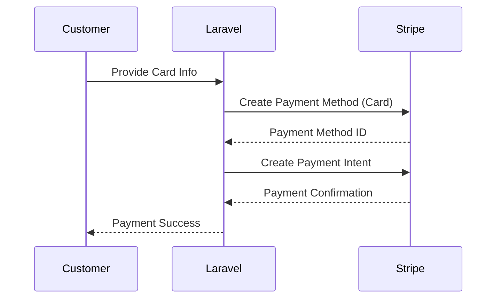
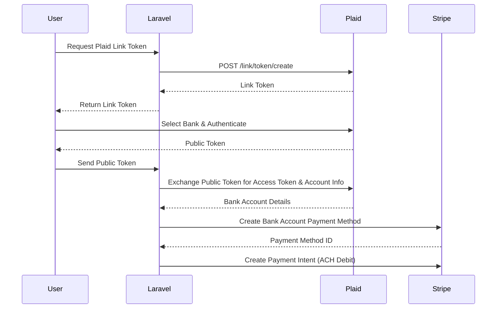
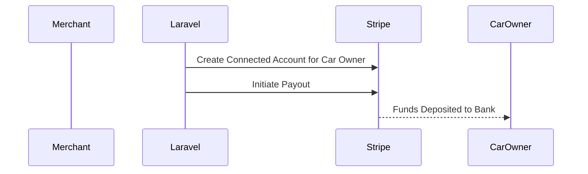

# Laravel Plaid + Stripe Integration Project

> A robust and secure integration between **Laravel**, **Plaid API**, and **Stripe API**, enabling users to link bank accounts, process card or ACH payments, and transfer payouts to car owners.

   

---

## System Flow

### 1. **Card Payments (Pay-In via Stripe)**



---

### 2. **Bank Account Pay-In (Plaid + Stripe ACH Debit)**



---

### 3. **Merchant Payout to Car Owners (Stripe Payout)**



---

## Key Features

* **Plaid Integration** for secure bank account linking
* **Stripe Pay-In** with:

  * Credit/Debit cards
  * ACH debits via Plaid-linked bank accounts
* **Stripe Payouts** to car owners’ bank accounts
* **Transaction Management Dashboard**
* **Secure API-first architecture**
* **Responsive UI** built with BootstrapCSS

---

## Prerequisites

* **PHP** 8.1+
* **Composer**
* **Node.js** 16+
* **MySQL** 5.7+
* **Plaid API credentials**
* **Stripe API keys** (secret & publishable)

---

## Installation

1. Clone the repository:

```bash
git clone https://github.com/engyahmed7/laravel-plaid-to-stripe-payments.git
cd laravel-plaid-to-stripe-payments
```

2. Install PHP dependencies:

```bash
composer install
```

3. Install JavaScript dependencies:

```bash
npm install
npm run dev
```

4. Create environment file:

```bash
cp .env.example .env
```

5. Generate application key:

```bash
php artisan key:generate
```

6. Configure environment variables in `.env`:

```ini
DB_DATABASE=your_database_name
DB_USERNAME=your_db_username
DB_PASSWORD=your_db_password

PLAID_CLIENT_ID=your_plaid_client_id
PLAID_SECRET=your_plaid_secret
PLAID_ENV=sandbox # or development/production

STRIPE_KEY=your_stripe_publishable_key
STRIPE_SECRET=your_stripe_secret_key
```

7. Run migrations:

```bash
php artisan migrate
```

---

## Usage

### **Card Pay-In**

1. Create a Stripe customer
2. Add a payment method (card)
3. Create a payment intent to charge the customer

### **Bank Account Pay-In via Plaid**

1. Use Plaid Link to connect a bank account
2. Exchange the public token for bank account info
3. Create a Stripe payment method of type `us_bank_account`
4. Create a Stripe payment intent to debit the bank account

### **Payout to Car Owners**

1. Create a Stripe connected account for the owner
2. Initiate payout using `Stripe::payouts->create()`

---

## Development Notes

> ⚠️ This project uses **Plaid’s Sandbox Environment** and **Stripe test mode** by default for development and testing.

For **production deployment**, follow these steps:

1. Replace sandbox credentials with production keys
2. Set `PLAID_ENV=production` in `.env`
3. Complete Plaid's **production onboarding process**

---

## Contributing

Contributions are welcome! Please follow these steps:

1. Fork the repository
2. Create a feature branch:  
   `git checkout -b feature/amazing-feature`
3. Commit your changes:  
   `git commit -m 'Add some amazing feature'`
4. Push to the branch:  
   `git push origin feature/amazing-feature`
5. Open a **Pull Request** with a clear description

---


## Learn More
For detailed documentation, visit:
* [Plaid Docs](https://plaid.com/docs/)
* [Stripe Docs](https://stripe.com/docs)
