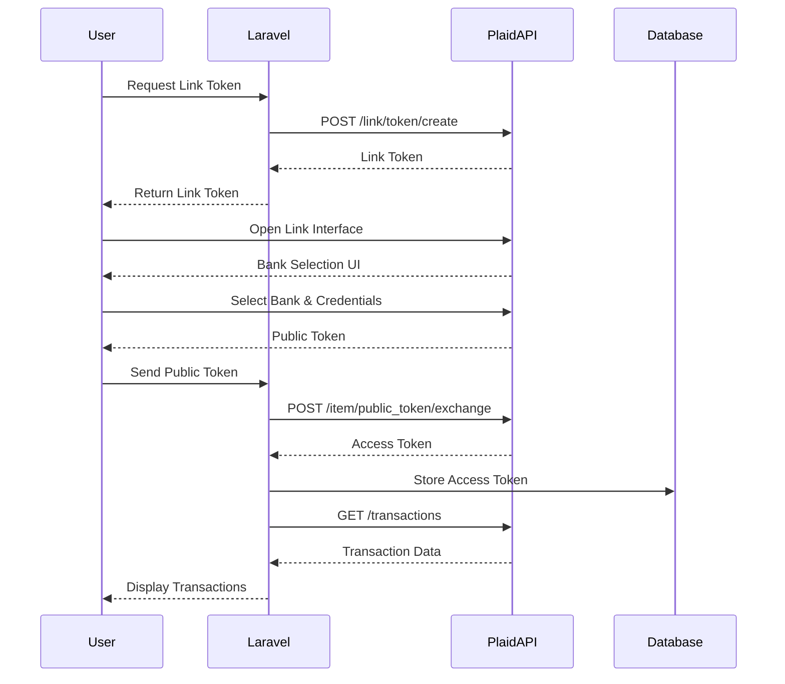

# Laravel Plaid Integration Project

> A robust and secure integration between **Laravel** and the **Plaid API**, enabling users to connect bank accounts, retrieve financial data, and manage transactions seamlessly.

  

---

## Plaid Integration Flow



---

## Key Features

-   **Secure Plaid API Integration** using industry-standard practices
-   **Bank Account Linking** via Plaid Link (client-side interface)
-   **Transaction Retrieval & Management** from connected accounts
-   **User Authentication System** built with Laravel Breeze
-   **Dashboard for Financial Overview**
-   **Responsive and Modern UI** powered by TailwindCSS
-   **Ready for Testing & Extensibility** in development and production environments

---

## Prerequisites

Before getting started, ensure you have the following installed:

-   **PHP** 8.1+
-   **Composer**
-   **Node.js** 16+
-   **npm** or **yarn**
-   **MySQL 5.7+** or compatible database
-   **Plaid API Credentials** (Client ID and Secret)

---

## Installation

1. Clone the repository:

```bash
git clone https://github.com/engyahmed7/laravel-plaid-integration.git
cd laravel-plaid-integration
```

2. Install PHP dependencies:

```bash
composer install
```

3. Install JavaScript dependencies:

```bash
npm install
npm run dev
```

4. Create environment file:

```bash
cp .env.example .env
```

5. Generate application key:

```bash
php artisan key:generate
```

6. Configure environment variables in `.env`:

```ini
DB_DATABASE=your_database_name
DB_USERNAME=your_db_username
DB_PASSWORD=your_db_password

PLAID_CLIENT_ID=your_plaid_client_id
PLAID_SECRET=your_plaid_secret
PLAID_ENV=sandbox # or development/production
```

7. Run migrations:

```bash
php artisan migrate
```

---

## Configuration

### Plaid Setup

1. Create a free account at [Plaid Dashboard](https://dashboard.plaid.com/)
2. Obtain your **Client ID** and **Secret** from the dashboard
3. Set the correct environment (`sandbox`, `development`, or `production`) in `.env`

---

## Usage

1. Start the development server:

```bash
php artisan serve
```

2. Visit `http://localhost:8000/register` to create a new account

3. Navigate to the **Connect Bank Account** page

4. Click **Connect with Plaid** to initiate the bank linking process

5. Select your financial institution and authenticate securely

6. View your transactions and financial data in real-time on the dashboard

---

## Project Structure

```
app/
├── Http/
│   ├── Controllers/
│   │   ├── PlaidController.php
│   │   └── ...
├── Services/
│   └── PlaidService.php
resources/
├── views/
│   ├── plaid/
│   │   └── connect.blade.php
│   └── layouts/
│       └── app.blade.php
public/
├── css/
│   └── plaid-index.css
├── js/
│   └── plaid-link.js
routes/
└── web.php
```

---

## Contributing

Contributions are welcome! Please follow these steps:

1. Fork the repository
2. Create a feature branch:  
   `git checkout -b feature/amazing-feature`
3. Commit your changes:  
   `git commit -m 'Add some amazing feature'`
4. Push to the branch:  
   `git push origin feature/amazing-feature`
5. Open a **Pull Request** with a clear description

---

## Notes

> ⚠️ This project uses **Plaid’s Sandbox Environment** by default for development and testing.

For **production deployment**, follow these steps:

1. Replace sandbox credentials with production keys
2. Set `PLAID_ENV=production` in `.env`
3. Complete Plaid's **production onboarding process**

---

## Learn More

For detailed documentation on the Plaid API, visit:
🔗 [Plaid API Documentation](https://plaid.com/docs/)
